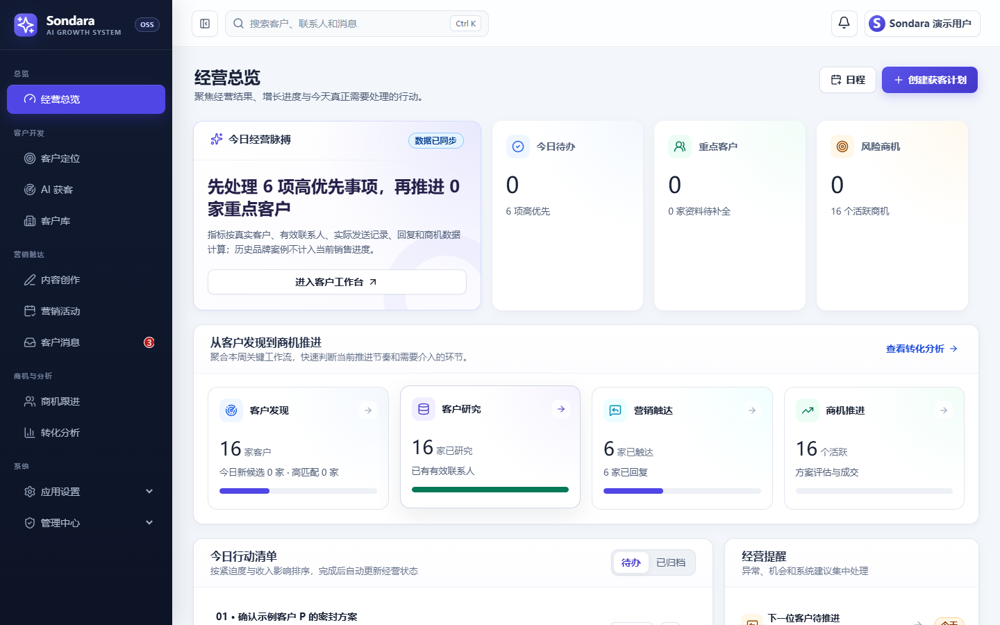
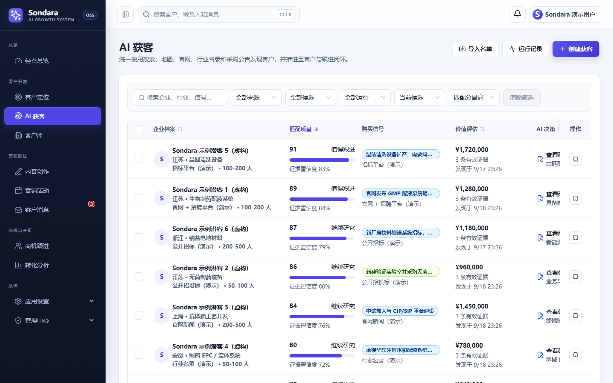
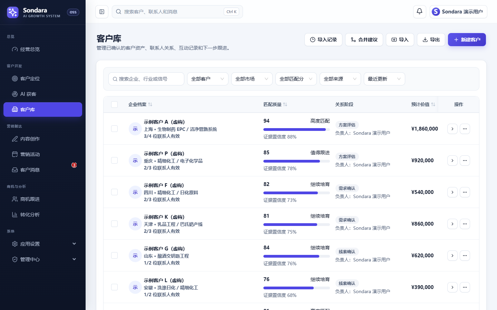
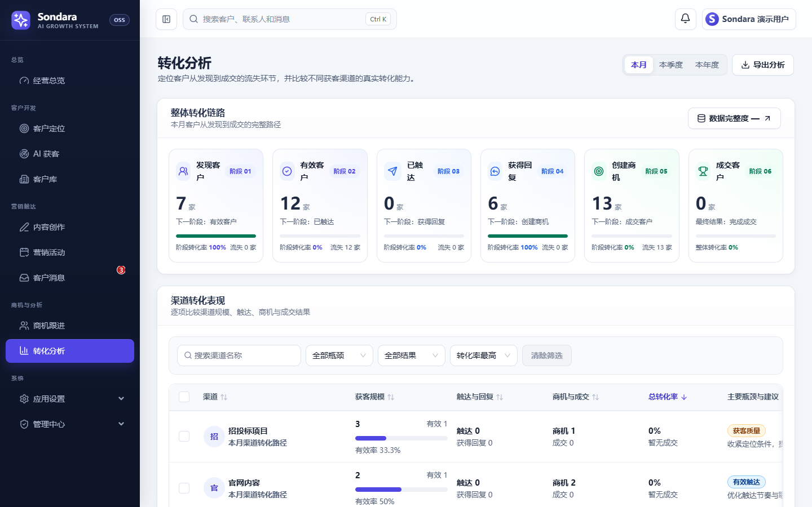

# Sondara

[English](./README.en.md) · [简体中文](./README.md)

[](https://github.com/huangheng-dev/Sondara/actions/workflows/ci.yml)
[](./LICENSE)

**Sondara is an open-source, self-hosted AI B2B lead generation and CRM workspace.** It brings customer discovery, account research, outreach, sales pipeline management, and revenue attribution into one workflow.

Run it locally for one person or deploy it for a team. Your customer data and provider credentials stay in infrastructure you control.

<p align="center">
  
</p>

## What Sondara does

```text
Define ICP → Discover companies → Research and score → Save accounts → Outreach and follow up → Opportunities → Revenue attribution
```

- Discover B2B companies from websites, search, Google Places, industry directories, exhibitions, and public procurement sources.
- Research and score accounts with evidence, confidence levels, and a visible scoring breakdown.
- Manage companies, contacts, relationship stages, estimated value, and next actions in one customer workspace.
- Create content assets and campaigns, then send through SMTP, SendGrid, Mailgun, compliant webhooks, or WhatsApp.
- Process replies through multiple IMAP inboxes and keep contact verification, suppression, bounce, and unsubscribe states synchronized.
- Move qualified accounts through a personal sales pipeline and attribute revenue by source and channel.
- Connect OpenAI Responses, OpenAI Chat Completions, or Anthropic Messages compatible AI providers with an encrypted BYOK vault.
- Configure search, web extraction, maps, email, and procurement connectors independently.
- Run locally with SQLite or deploy a multi-account instance behind a reverse proxy.

## Product preview

<table>
  <tr>
    <td width="50%" valign="top">
      
      <br />
      <strong>AI lead discovery</strong><br />
      Combine search, company websites, directories, and buying signals with match scores and source evidence.
    </td>
    <td width="50%" valign="top">
      
      <br />
      <strong>Customer workspace</strong><br />
      Manage account profiles, contacts, stages, estimated value, and next actions in one place.
    </td>
  </tr>
  <tr>
    <td colspan="2" valign="top">
      
      <br />
      <strong>Conversion and attribution</strong><br />
      Compare channels across discovery, research, outreach, replies, opportunities, and closed revenue.
    </td>
  </tr>
</table>

## Quick start

Sondara requires Node.js 24 LTS. SQLite is included, so no separate database service is needed for a local installation.

```bash
git clone https://github.com/huangheng-dev/Sondara.git
cd Sondara
npm install
npm run setup -- --non-interactive
npm run start:local
```

Open `http://localhost:4175`. The API runs at `http://127.0.0.1:4176`, and its health endpoint is `/api/healthz`.

For a production or personal deployment, register the first account in a blank database. The first registered user becomes the workspace owner.

## Technology

- React 19, TypeScript, Vite 8
- React Router 7, TanStack Query, Zustand
- Ant Design 6, Lucide React
- Fastify 5, SQLite, Drizzle ORM
- AES-256-GCM encrypted credential vault

## Deployment and operations

- [Production deployment](./docs/DEPLOY.md)
- [Upgrade guide](./docs/UPGRADE.md)
- [Core roadmap](./docs/CORE_ROADMAP.md)
- [Integration closure guide](./docs/INTEGRATION_CLOSURE.md)
- [Public repository checklist](./docs/PUBLIC_REPO_CHECKLIST.md)

Before publishing or deploying a change, run:

```bash
npm run qa:all
```

The full quality gate includes repository safety checks, TypeScript validation, production builds, bundle budgets, Playwright end-to-end coverage, a production smoke test, and integration tests.

## Security and responsible use

Sondara stores AI, search, email, and connector credentials in its encrypted BYOK vault. Keep production secrets out of source control and rotate any credential that has entered Git history.

Public data collection and outbound communication must follow the target site's terms, applicable privacy law, and anti-spam requirements. Sondara does not include login bypass, CAPTCHA bypass, or unofficial bulk messaging behavior.

See [SECURITY.md](./SECURITY.md) to report a vulnerability.

## Contributing

Issues, documentation improvements, and pull requests are welcome. Read [CONTRIBUTING.md](./CONTRIBUTING.md) before submitting a change.

If Sondara is useful to you, please star the repository and share it with teams building international B2B sales workflows.

## License

[MIT](./LICENSE)
